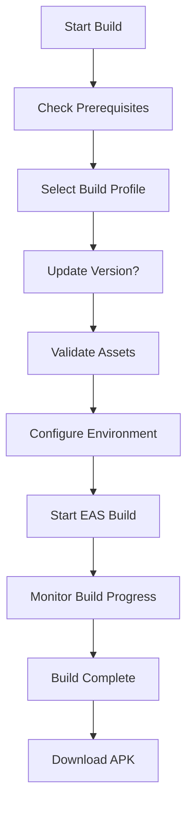

# 📱 APK Generator Module - TPQ Wali Santri

Module lengkap untuk generate APK aplikasi mobile TPQ Wali Santri dengan automasi penuh.

## 🎯 Overview

Module ini menyediakan tools dan scripts untuk:

- ✅ **Automated APK building** dengan berbagai profile
- ✅ **Asset management** dan validasi
- ✅ **Environment configuration** untuk berbagai environment
- ✅ **Build status monitoring** dan troubleshooting
- ✅ **Interactive CLI** untuk kemudahan penggunaan

## 📁 Module Structure

```
mobile-app/
├── scripts/
│   ├── build-apk.js          # Main APK builder script
│   ├── setup-build.js        # Build environment setup
│   ├── generate-assets.js    # Asset generator and validator
│   └── manage-env.js         # Environment management
├── assets/
│   ├── icon.png              # App icon (1024x1024)
│   ├── adaptive-icon.png     # Android adaptive icon
│   ├── splash.png            # Splash screen
│   ├── fonts/                # Custom fonts directory
│   └── README.md             # Asset guidelines
├── .env.example              # Environment variables template
├── eas.json                  # EAS build configuration
└── APK_GENERATOR_MODULE.md   # This documentation
```

## 🚀 Quick Start

### 1. Setup Build Environment

```bash
# Navigate to mobile app directory
cd mobile-app

# Setup build environment (one-time setup)
npm run setup:build
```

### 2. Generate Required Assets

```bash
# Generate asset templates and documentation
npm run generate:assets

# Check asset status
ls -la assets/
```

### 3. Configure Environment Variables

```bash
# Create environment files from template
npm run env:create

# Configure specific environment
npm run env:configure

# Check environment status
npm run env:status
```

### 4. Build APK

```bash
# Interactive APK builder (recommended)
npm run build:apk

# Or build specific profile
npm run build:preview      # Preview APK
npm run build:production   # Production APK
```

## 🛠️ Available Scripts

### Build Scripts

| Script                     | Description                                    | Output     |
| -------------------------- | ---------------------------------------------- | ---------- |
| `npm run build:apk`        | Interactive APK builder with profile selection | APK file   |
| `npm run build:preview`    | Quick preview build for testing                | APK file   |
| `npm run build:production` | Production build for release                   | APK file   |
| `npm run build:status`     | Check recent build status                      | Build list |

### Setup Scripts

| Script                    | Description              | Purpose          |
| ------------------------- | ------------------------ | ---------------- |
| `npm run setup:build`     | Setup build environment  | One-time setup   |
| `npm run generate:assets` | Generate asset templates | Asset management |

### Environment Scripts

| Script                  | Description                     | Purpose            |
| ----------------------- | ------------------------------- | ------------------ |
| `npm run env:create`    | Create environment files        | Environment setup  |
| `npm run env:configure` | Configure environment variables | Environment config |
| `npm run env:validate`  | Validate environment files      | Environment check  |
| `npm run env:status`    | Show environment status         | Environment info   |

## 🏗️ Build Profiles

### Development Profile

- **Purpose**: Internal testing dengan debugging tools
- **Features**:
  - Development client enabled
  - Debug mode active
  - Flipper integration
  - Hot reload support
- **Command**: `eas build --profile development`
- **Output**: Development APK dengan debugging

### Preview Profile

- **Purpose**: Testing sebelum production release
- **Features**:
  - Production-like build
  - No debugging tools
  - Performance optimized
  - Internal distribution
- **Command**: `npm run build:preview`
- **Output**: Preview APK untuk testing

### Production Profile

- **Purpose**: Final release untuk app store
- **Features**:
  - Fully optimized
  - Code obfuscation
  - Minimal bundle size
  - Store-ready signing
- **Command**: `npm run build:production`
- **Output**: Production APK untuk release

## 📦 Asset Management

### Required Assets

#### App Icons

```
assets/icon.png              # 1024x1024px - Main app icon
assets/adaptive-icon.png     # 1024x1024px - Android adaptive icon
assets/favicon.png           # 48x48px - Web favicon
assets/notification-icon.png # 96x96px - Notification icon
```

#### Splash Screen

```
assets/splash.png            # 1284x2778px - Splash screen image
```

#### Fonts

```
assets/fonts/Inter-Regular.ttf    # Regular weight (400)
assets/fonts/Inter-Medium.ttf     # Medium weight (500)
assets/fonts/Inter-SemiBold.ttf   # SemiBold weight (600)
assets/fonts/Inter-Bold.ttf       # Bold weight (700)
```

### Asset Generation

```bash
# Generate asset templates and guidelines
npm run generate:assets

# This creates:
# - assets/README.md (detailed guidelines)
# - assets/placeholders/ (SVG templates)
# - Directory structure
```

### Asset Validation

The `generate-assets.js` script automatically validates:

- ✅ Required asset files exist
- ✅ Proper directory structure
- ✅ Asset specifications compliance
- ✅ Font availability

## 🌍 Environment Management

### Environment Files

```
.env.development    # Local development settings
.env.staging        # Staging/preview settings
.env.production     # Production settings
.env.example        # Template file
```

### Environment Variables

```bash
# API Configuration
API_BASE_URL=http://localhost:3000/api
API_TIMEOUT=10000

# App Configuration
APP_ENV=development
APP_VERSION=1.0.0
APP_BUILD_NUMBER=1

# Feature Flags
ENABLE_PUSH_NOTIFICATIONS=true
ENABLE_ANALYTICS=true
DEBUG_MODE=true
```

### Environment Commands

```bash
# Create all environment files from template
npm run env:create

# Configure specific environment interactively
npm run env:configure

# Validate all environment files
npm run env:validate

# Show status of all environments
npm run env:status
```

## 🔧 Build Configuration

### EAS Configuration (eas.json)

```json
{
  "build": {
    "development": {
      "developmentClient": true,
      "distribution": "internal",
      "android": {
        "buildType": "apk",
        "gradleCommand": ":app:assembleDebug"
      }
    },
    "preview": {
      "distribution": "internal",
      "android": {
        "buildType": "apk",
        "gradleCommand": ":app:assembleRelease"
      }
    },
    "production": {
      "android": {
        "buildType": "apk",
        "gradleCommand": ":app:assembleRelease"
      }
    }
  }
}
```

### App Configuration (app.json)

Key configurations for building:

- **Package name**: `com.tpqbaitusshuffah.wali`
- **Version management**: Automatic version bumping
- **Icon and splash**: Asset references
- **Permissions**: Required Android permissions

## 📊 Build Process Flow



## 🔍 Troubleshooting

### Common Issues

#### Prerequisites Not Met

```bash
# Install EAS CLI
npm install -g @expo/eas-cli

# Login to Expo
eas login

# Check login status
eas whoami
```

#### Build Failures

```bash
# Clear build cache
eas build --clear-cache

# Clear local cache
expo r -c

# Reinstall dependencies
rm -rf node_modules
npm install
```

#### Asset Issues

```bash
# Regenerate assets
npm run generate:assets

# Check asset status
ls -la assets/

# Validate assets
npm run generate:assets
```

#### Environment Issues

```bash
# Recreate environment files
npm run env:create

# Validate environment
npm run env:validate

# Check environment status
npm run env:status
```

### Debug Commands

```bash
# Check build status
npm run build:status

# View specific build
eas build:view [build-id]

# Check EAS configuration
eas config

# View build logs
eas build:list --limit 10
```

## 📈 Advanced Features

### Automated Version Management

The build script can automatically:

- ✅ Increment version numbers
- ✅ Update build numbers
- ✅ Maintain version history
- ✅ Sync across environments

### Build Monitoring

- ✅ Real-time build progress
- ✅ Build status notifications
- ✅ Build history tracking
- ✅ Error reporting

### Asset Optimization

- ✅ Automatic asset validation
- ✅ Size optimization recommendations
- ✅ Format conversion suggestions
- ✅ Placeholder generation

## 🚀 Production Deployment

### Pre-Release Checklist

- [ ] All assets optimized and validated
- [ ] Environment variables configured
- [ ] Version numbers updated
- [ ] Testing completed on preview build
- [ ] App signing configured

### Release Process

1. **Build production APK**: `npm run build:production`
2. **Download and test APK**
3. **Upload to Google Play Console**
4. **Submit for review**
5. **Monitor release metrics**

## 📞 Support

### Build Issues

- **Expo Documentation**: https://docs.expo.dev/
- **EAS Build Docs**: https://docs.expo.dev/build/introduction/
- **Community Support**: Expo Discord

### Module Issues

- **Email**: tech@tpqbaitusshuffah.com
- **GitHub Issues**: Create issue in repository

---

**Barakallahu fiikum** - Semoga module ini memudahkan proses build APK! 🚀
